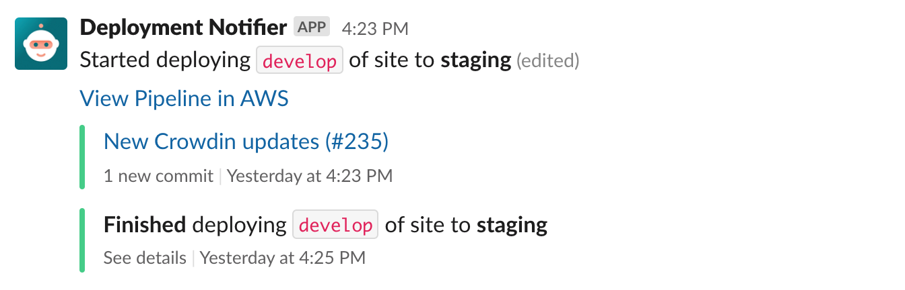

# Slack Notifier

_An AWS Lambda for sending deployment updates to Slack._
_Supports GitHub Actions and CodePipeline deployments._

 



## Setup

First, init the shared module in your [Terraform](https://www.terraform.io/) project:

```terraform
module "shared_slack_notifier_module" {
  source = "git@github.com:agendrix/slack-notifier.git//terraform/shared?ref=main"

  aws_s3_bucket_name  = "slack-deployments-notifications"
  aws_iam_role_name   = "RoleForSlackNotifier"
  aws_iam_policy_name = "PolicyForSlackNotifier"
}
```

This will create a shared S3 bucket and the IAM role & policy required for every instance of the Slack Notifier.

You will need to generate some tokens:

- `slack_access_token`: Follow the Slack documentation [here](https://api.slack.com/authentication/token-types).
- `github_oauth_token`: Token to fetch private repository from GitHub.

### GitHub Actions

If you want to get notifications for a GitHub Actions deployment, append this to your terraform:

```terraform
module "gh_slack_notifications" {
  source = "git@github.com:agendrix/slack-notifier.git//terraform?ref=v1.0.0"

  lambda_name   = "gh-actions-slack-notifier"
  slack_channel = "#my-app"
  slack_url     = "my-org.slack.com"
  repo = {
    owner  = "org"
    name   = "example"
    branch = "main"
  }

  deployment_type = "GitHub Actions"
  api_secret      = var.slack_notifier_secret

  environment        = var.environment
  slack_access_token = var.slack_access_token
  github_oauth_token = var.github_oauth_token
  shared_module      = module.shared_slack_notifier_module
}
```

The module output the `aws_lambda_function` function (`module.gh_slack_notifications.lambda_function`).
In order to be able to receive http request to the lambda, you will need to hook it up with an AWS API Gateway.
You can do so by following this guide: [Serverless Applications with AWS Lambda and API Gateway](https://learn.hashicorp.com/tutorials/terraform/lambda-api-gateway).

To prevent anyone outside of your workflow to ping the lambda API, generate an `api_secret`.
This can be anything. You can simply generate one using `openssl rand -base64 64 | head -1`.

Finally, add the GitHub action to your GitHub workflow by following [this example](./ping-slack/README.md).

### CodePipeline

If you want to get notifications for an AWS CodePipeline deployment, append this to your terraform:

```terraform
module "codepipeline_slack_notifications" {
  source = "git@github.com:agendrix/slack-notifier.git//terraform?ref=v1.0.0"

  lambda_name   = "codepipeline-slack-notifier"
  slack_channel = "#my-app"
  slack_url     = "my-org.slack.com"
  repo = {
    owner  = "org"
    name   = "example"
    branch = "main"
  }

  deployment_type = "CodePipeline"
  codepipeline_refs = {
    region                      = var.region
    account_id                  = var.account_id
    codepipeline                = aws_codepipeline.codepipeline
    codedeploy_deployment_group = aws_codedeploy_deployment_group.codedeploy_deployment_group
    ecr_ref_repository          = aws_ecr_repository.repo.name
  }

  environment        = var.environment
  slack_access_token = var.slack_access_token
  github_oauth_token = var.github_oauth_token
  shared_module      = module.shared_slack_notifier_module
}
```

Now, your CodePipeline will send notification update to Slack on every deployment.
